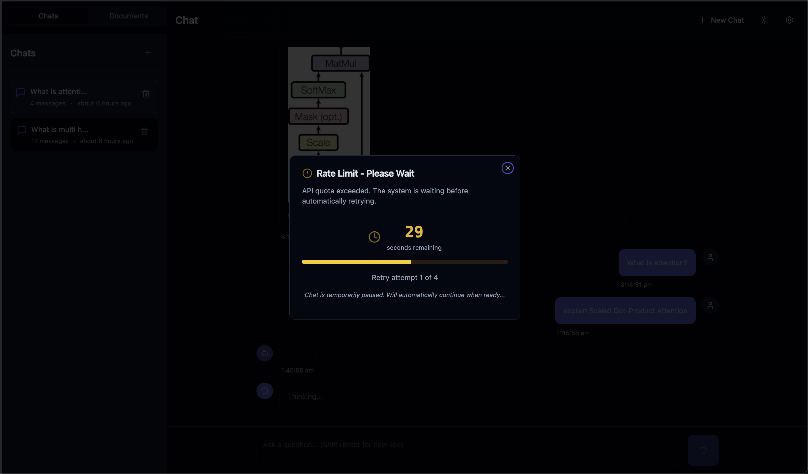

# Multimodal RAG System

A powerful **Multimodal Retrieval-Augmented Generation (RAG)** system that enables intelligent querying of PDF documents with support for text, tables, and images. Built with FastAPI backend and React frontend.


## 🎯 Overview

This system processes PDF documents to extract text, tables, and images, generates intelligent summaries using Google Gemini AI, and provides natural language question-answering with source citations. It uses vector search (ChromaDB with Ollama embeddings) for semantic retrieval and Google Gemini for conversational AI.

## ✨ Key Features

- **📄 PDF Processing**: Extracts text, tables, and images from PDF documents
- **🤖 AI-Powered Summarization**: Generates intelligent summaries using Google Gemini
- **🔍 Semantic Search**: Vector-based retrieval using ChromaDB and Ollama embeddings
- **💬 Conversational AI**: Natural language Q&A with context-aware responses
- **📊 Source Citations**: Answers include page references with relevance scores
- **🌊 Streaming Responses**: Real-time token-by-token streaming via Server-Sent Events
- **💾 Persistent Sessions**: Chat history and conversation context management
- **🎨 Modern UI**: React-based interface with dark/light theme support

## 🎬 Demo

<p align="center">
  <a href="demo/demo_video.mp4">
    ▶️ <strong>Watch Demo Video</strong>
  </a>
</p>

### Rate Limiting Feature

The application includes intelligent rate limiting to handle API quota limits gracefully:

<p align="center">
  
</p>

When API rate limits are exceeded, the system automatically:
- Displays a user-friendly notification with countdown timer
- Implements automatic retry mechanism (up to 4 attempts)
- Pauses chat interactions until the limit resets
- Provides real-time feedback on retry attempts

## 🏗️ Architecture

```
┌─────────────────┐
│  React Frontend  │ (TypeScript, shadcn/ui, Tailwind CSS)
└────────┬────────┘
         │ REST API / SSE
┌────────▼──────────────────────────┐
│      FastAPI Backend              │
│  ┌─────────────────────────────┐  │
│  │  PDF Service                │  │ (Unstructured.io)
│  │  Summary Service            │  │ (Google Gemini)
│  │  Vector Service             │  │ (ChromaDB + Ollama)
│  │  RAG Service                │  │ (Orchestration)
│  │  LLM Service                │  │ (Google Gemini)
│  └─────────────────────────────┘  │
└────────┬──────────────────────────┘
         │
    ┌────┴────┐
    │ SQLite  │ (Metadata)
    │ ChromaDB│ (Vectors)
    └─────────┘
```

## 🚀 Quick Start

### Option 1: Docker (Recommended) 🐳

The easiest way to run the entire system with all dependencies:

1. **Prerequisites**
   - Docker Engine 20.10+
   - Docker Compose 2.0+
   - Google Gemini API Key

2. **Setup Environment**
   
   Create `.env` file in the project root:
   ```bash
   # Copy environment file to root
   cp .env.example .env
   # Edit .env and add your GOOGLE_API_KEY
   ```
   
   **Note**: The backend looks for `.env` in the project root first, then falls back to `backend/.env` if root `.env` doesn't exist (for backward compatibility).

3. **Start Everything**
   
   Start Docker containers (choose ONE mode). The embedding model will be automatically pulled on first startup:
   ```bash
   # Production mode (recommended)
   docker-compose up -d
   
   # OR Development mode (with hot reload for backend/frontend)
   docker-compose --profile dev up -d
   ```
   
   **Note:** 
   - The first startup may take 2-5 minutes as it downloads the embedding model (~621 MB). You can monitor progress with `docker logs multimodal-rag-ollama-init`
   - Subsequent startups will be much faster since the model is cached in the `ollama-data` volume
   - If you need to manually pull/update the model later: `docker exec multimodal-rag-ollama ollama pull embeddinggemma:latest`

4. **Access the Application**
   - Frontend: http://localhost:5173
   - Backend API: http://localhost:8000
   - API Docs: http://localhost:8000/docs
   - Ollama: http://localhost:11434

### Option 2: Local Development 💻

For development without Docker (requires manual installation of system dependencies):

**📖 See [SETUP_LOCAL.md](./SETUP_LOCAL.md) for complete platform-specific instructions (macOS, Linux, Windows).**

1. **Prerequisites**
   - **Python 3.11+**
   - **Node.js & npm** (for frontend)
   - **Ollama** installed and running
   - **Google Gemini API Key** ([Get one here](https://ai.google.dev/))

2. **Setup Ollama**
   ```bash
   # Install Ollama from https://ollama.ai
   ollama serve
   ollama pull embeddinggemma:latest
   ```

3. **Backend Setup**

   **Install System Dependencies** (required for PDF processing):
   
   **macOS:**
   ```bash
   brew install poppler tesseract libmagic
   ```
   
   **Linux (Ubuntu/Debian):**
   ```bash
   sudo apt-get install poppler-utils tesseract-ocr libmagic-dev
   ```
   
   **Windows:**
   ```bash
   # Using Chocolatey (install from https://chocolatey.org/)
   choco install poppler tesseract libmagic
   
   # OR using winget
   winget install poppler tesseract-ocr libmagic
   ```
   
   **Then install Python dependencies:**
   ```bash
   cd backend
   
   # Using Poetry (recommended)
   poetry install --no-root
   
   # OR using pip
   python -m venv .venv
   source .venv/bin/activate  # On Windows: .venv\Scripts\activate
   pip install -r requirements.txt
   
   # Configure environment
   # Create .env in project root (not backend/.env)
   cp .env.example .env  # If .env.example exists, or create manually
   # Edit .env and add your GOOGLE_API_KEY
   ```

4. **Frontend Setup**
   ```bash
   cd frontend
   npm install
   ```

5. **Running the Application**
   ```bash
   # Terminal 1: Start Backend
   cd backend
   poetry run uvicorn app.main:app --reload --host 0.0.0.0 --port 8000
   
   # Terminal 2: Start Frontend
   cd frontend
   npm run dev
   ```

6. **Access the Application**
   - Frontend: http://localhost:5173
   - Backend API: http://localhost:8000
   - API Docs: http://localhost:8000/docs

## 📖 Usage

1. **Upload Documents**
   - Navigate to the upload page or use the document sidebar
   - Drag and drop or select a PDF file
   - Wait for processing to complete (extraction, summarization, indexing)

2. **Chat with Documents**
   - Select a document (optional) or chat across all documents
   - Type your question in the chat interface
   - Receive answers with source citations showing:
     - Page numbers
     - Content previews
     - Relevance scores
     - Image thumbnails (if applicable)

3. **Manage Sessions**
   - Create new chat sessions
   - View conversation history
   - Delete old sessions

## 🐳 Docker Quick Commands

```bash
# Start services (production)
docker-compose up -d

# Start services (development with hot reload)
docker-compose --profile dev up -d

# View logs
docker-compose logs -f

# View specific service logs
docker-compose logs -f backend
docker-compose logs -f frontend
docker-compose logs -f ollama

# Stop services
docker-compose down

# Stop and remove volumes (WARNING: deletes data)
docker-compose down -v

# Rebuild images
docker-compose build --no-cache

# Rebuild specific service
docker-compose build --no-cache backend

# Initialize Ollama model (required after first start)
docker exec -it multimodal-rag-ollama ollama pull embeddinggemma:latest

# Check service status
docker-compose ps

# Access container shell
docker exec -it multimodal-rag-backend bash
docker exec -it multimodal-rag-frontend sh
```

## 🔧 Configuration

### Backend Environment Variables

Create `.env` file in the project root:

```env
# REQUIRED: Google Gemini API Key
GOOGLE_API_KEY=your_google_gemini_api_key_here

# Optional: Model overrides
CHAT_MODEL_ID=gemini-2.0-flash
TEXT_SUMMARIZER_MODEL_ID=gemini-2.0-flash
IMAGE_SUMMARIZER_MODEL_ID=gemini-2.0-flash

# Ollama Configuration
# For local dev: http://localhost:11434
# For Docker: http://ollama:11434 (automatically set in docker-compose)
OLLAMA_BASE_URL=http://localhost:11434
EMBEDDING_MODEL_ID=embeddinggemma:latest

# Database (optional)
DATABASE_URL=sqlite:///./data/app.db

# Logging (optional)
LOG_LEVEL=INFO

# Concurrency (optional)
TEXT_SUMMARIZER_MAX_WORKERS=4

# Upload constraints (optional)
MAX_UPLOAD_MB=25
```

### Frontend Configuration

Create `frontend/.env.local` (optional):

```env
VITE_API_BASE=http://localhost:8000
```

## 📁 Project Structure

```
Multimodal RAG/
├── backend/
│   ├── app/
│   │   ├── api/v1/          # API endpoints (chat, documents, upload, health)
│   │   ├── core/            # Configuration and logging
│   │   ├── db/              # Database setup and migrations
│   │   ├── models/          # SQLAlchemy models (document, message)
│   │   ├── repositories/    # Data access layer
│   │   ├── schemas/         # Pydantic schemas
│   │   ├── services/        # Business logic (PDF, RAG, vector, summary, LLM)
│   │   └── utils/           # Utilities (file handling, rate limiting)
│   ├── chroma_db/           # Vector database storage
│   ├── data/                # SQLite DB, uploads, logs, parents_index
│   ├── reference code/      # Jupyter notebooks for experimentation
│   └── main.py              # FastAPI entry point
├── frontend/
│   ├── src/
│   │   ├── components/      # React components (Chat, Sidebar, Upload, etc.)
│   │   ├── pages/           # Page components (ChatPage, UploadPage, etc.)
│   │   ├── lib/             # API client and utilities
│   │   └── types/           # TypeScript types
│   └── package.json
├── demo/                    # Demo video and screenshots
├── scripts/                 # Init scripts for Ollama
├── docker-compose.yml       # Docker orchestration
├── fresh_start.py          # Cleanup script
└── README.md                # This file
```

## 🔌 API Endpoints

### Document Management
- `POST /api/upload` - Upload and process PDF
- `GET /api/upload/status/{doc_id}` - Get upload processing status
- `GET /api/documents` - List all documents
- `DELETE /api/documents/{doc_id}` - Delete document

### Chat
- `POST /api/chat` - Send chat message (non-streaming)
- `GET /api/chat/stream` - Stream chat responses (SSE)
- `GET /api/chat/messages/{session_id}` - Get chat history for a session
- `GET /api/chat/sessions` - List all chat sessions
- `GET /api/chat/sessions/{session_id}` - Get session summary information
- `DELETE /api/chat/sessions/{session_id}` - Delete session

### Health
- `GET /api/health` - API health check

See [backend/README.md](./backend/README.md) for detailed API documentation.

## 🤖 Models Used

- **Google Gemini 2.0 Flash**: Chat, text summarization, and image analysis
- **Ollama EmbeddingGemma**: Local embeddings for semantic search

## 🛠️ Technology Stack

### Backend
- FastAPI - Web framework
- LangChain - AI orchestration
- ChromaDB - Vector database
- SQLAlchemy - ORM
- Unstructured.io - PDF processing
- Ollama - Local embeddings
- Google Gemini - LLM

### Frontend
- React 18 - UI framework
- TypeScript - Type safety
- Vite - Build tool
- shadcn/ui - UI components
- Tailwind CSS - Styling
- TanStack Query - Data fetching
- React Router - Routing

## 📚 Documentation

- **[SETUP_LOCAL.md](./SETUP_LOCAL.md)** - Complete local setup guide (without Docker) with platform-specific instructions
- **[Backend README](./backend/README.md)** - Detailed backend documentation
- **[Frontend README](./frontend/README.md)** - Frontend setup and usage
- **[Project Summary](./PROJECT_SUMMARY.md)** - Comprehensive technical overview

## 🧪 Development

### Backend Development
```bash
cd backend
poetry run uvicorn app.main:app --reload
```

### Frontend Development
```bash
cd frontend
npm run dev
```

### Running Tests
```bash
# Backend tests (if available)
cd backend
pytest

# Frontend tests (if available)
cd frontend
npm test
```

## 📝 Workflow

1. **Document Upload** → PDF extraction → Summarization → Vector indexing
2. **User Query** → Vector search → Context retrieval → Answer generation
3. **Response** → Streaming → Source attachment → Display

See [PROJECT_SUMMARY.md](./PROJECT_SUMMARY.md) for detailed workflow explanation.

## 🔒 Security Notes

- Never commit `.env` files (they're in `.gitignore`)
- Store API keys in environment variables only
- Use HTTPS in production
- Validate file uploads (size, type)
- Keep Docker images updated for security patches

## 🐛 Troubleshooting

### Docker Issues

**Ollama not connecting:**
```bash
# Check if Ollama is running
docker-compose ps ollama

# Check Ollama logs
docker-compose logs ollama

# Verify model is pulled
docker exec -it multimodal-rag-ollama ollama list
```

**Backend can't connect to Ollama:**
- In Docker, backend automatically uses `http://ollama:11434`
- For local dev, ensure Ollama is running on `http://localhost:11434`

**Port conflicts:**
- Change ports in `docker-compose.yml` if 8000, 5173, or 11434 are in use

**Permission issues:**
```bash
# Fix data directory permissions
sudo chown -R $(id -u):$(id -g) backend/data backend/chroma_db
```

**Out of memory:**
- Ollama and PyTorch can use significant RAM
- Minimum 4GB RAM required
- Increase Docker Desktop memory limits if needed

## 🤝 Contributing

1. Fork the repository
2. Create a feature branch
3. Make your changes
4. Submit a pull request

## 📄 License

[Add your license here]

## 🙏 Acknowledgments

- Google Gemini for AI capabilities
- Ollama for local embeddings
- Unstructured.io for PDF processing
- LangChain for AI orchestration
- shadcn/ui for UI components

## 📞 Support

For issues and questions:
- Check the documentation in `PROJECT_SUMMARY.md`
- Review backend/frontend README files
- Check Docker logs: `docker-compose logs -f`
- Open an issue on the repository

---

**Made with ❤️ for intelligent document Q&A**